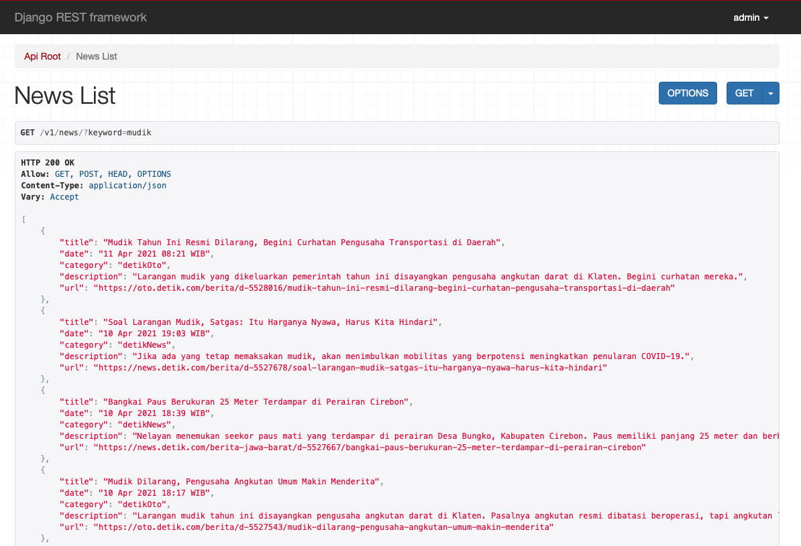
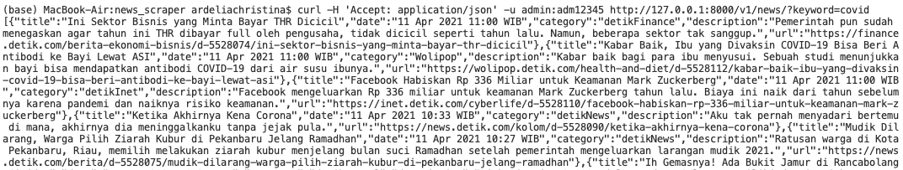

# News Scraper API (MVP)
API to search the news by scraping detik.com and return a list of news details from a specific keyword(s).


## Resource Specification

| Specification    | Value                         |
| ---------------- | ----------------------------- |
| Resource URL     | http://\[host][port]/v1/news/ |
| Request Verb     | GET                           |
| Content Type     | application/json              |
| Interaction Type | Synchronous                   |


## Request and Response

### Request Query Parameters

| Element Name | Data Type | Repeatable | Length | M/O  | Description                |
| ------------ | --------- | ---------- | ------ | ---- | -------------------------- |
| keyword      | String    | No         | N/A    | M    | Keyword to scrape the news |

**M = Mandatory, O = Optional*

Request Query Example:

```bash
http://[host][port]/v1/news/?keyword=mudik
```


### Response Body Parameters

| Element Name | Data Type | Repeatable | Length | M/O  | Description      |
| ------------ | --------- | ---------- | ------ | ---- | ---------------- |
| root         | Object    | Yes        | N/A    | M    | Root Object      |
| title        | String    | No         | 200    | O    | News Title       |
| date         | String    | No         | 30     | O    | News Posted Date |
| category     | String    | No         | 20     | O    | News Category    |
| description  | String    | No         | 500    | O    | News Description |
| url          | String    | No         | 500    | O    | News URL         |

**M = Mandatory, O = Optional*

Response Body Success Example:

```json
[
    {
        "title": "Mudik Tahun Ini Resmi Dilarang, Begini Curhatan Pengusaha Transportasi di Daerah",
        "date": "11 Apr 2021 08:21 WIB",
        "category": "detikOto",
        "description": "Larangan mudik yang dikeluarkan pemerintah tahun ini disayangkan pengusaha angkutan darat di Klaten. Begini curhatan mereka.",
        "url": "https://oto.detik.com/berita/d-5528016/mudik-tahun-ini-resmi-dilarang-begini-curhatan-pengusaha-transportasi-di-daerah"
    },
    {
        "title": "Soal Larangan Mudik, Satgas: Itu Harganya Nyawa, Harus Kita Hindari",
        "date": "10 Apr 2021 19:03 WIB",
        "category": "detikNews",
        "description": "Jika ada yang tetap memaksakan mudik, akan menimbulkan mobilitas yang berpotensi meningkatkan penularan COVID-19.",
        "url": "https://news.detik.com/berita/d-5527678/soal-larangan-mudik-satgas-itu-harganya-nyawa-harus-kita-hindari"
    },
    {
        "title": "Bangkai Paus Berukuran 25 Meter Terdampar di Perairan Cirebon",
        "date": "10 Apr 2021 18:39 WIB",
        "category": "detikNews",
        "description": "Nelayan menemukan seekor paus mati yang terdampar di perairan Desa Bungko, Kabupaten Cirebon. Paus memiliki panjang 25 meter dan berbobot sekitar 10 ton.",
        "url": "https://news.detik.com/berita-jawa-barat/d-5527667/bangkai-paus-berukuran-25-meter-terdampar-di-perairan-cirebon"
    },
    {
        "title": "Mudik Dilarang, Pengusaha Angkutan Umum Makin Menderita",
        "date": "10 Apr 2021 18:17 WIB",
        "category": "detikOto",
        "description": "Larangan mudik tahun ini disayangkan pengusaha angkutan darat di Klaten. Pasalnya angkutan resmi dibatasi beroperasi, tapi angkutan lain bebas.",
        "url": "https://oto.detik.com/berita/d-5527543/mudik-dilarang-pengusaha-angkutan-umum-makin-menderita"
    },
    {
        "title": "Dukung Pemerintah Pusat, Pemkot-Pemkab Cirebon Larang Warga Mudik",
        "date": "10 Apr 2021 18:14 WIB",
        "category": "detikNews",
        "description": "Pemkot dan Pemkab Cirebon mendukung langkah pemerintah pusat terkait pelarangan mudik Lebaran 2021. Masyarakat Cirebon agar mematuhi kebijakan tersebut.",
        "url": "https://news.detik.com/berita-jawa-barat/d-5527632/dukung-pemerintah-pusat-pemkot-pemkab-cirebon-larang-warga-mudik"
    },
    {
        "title": "Mudik Dilarang, Terminal Kampung Rambutan Tutup Rute Antar Kota",
        "date": "10 Apr 2021 15:32 WIB",
        "category": "detikNews",
        "description": "Terminal Kampung Rambutan akan menutup akses keberangkatan bus berpenumpang pada 6 -17 Mei 2021. Langkah itu menyusul kebijakan larangan mudik dari peme",
        "url": "https://news.detik.com/detiktv/d-5527457/mudik-dilarang-terminal-kampung-rambutan-tutup-rute-antar-kota"
    },
    {
        "title": "Larangan Mudik 6-17 Mei, Bisa Pulang Kampung Sebelumnya?",
        "date": "10 Apr 2021 14:30 WIB",
        "category": "detikOto",
        "description": "Pemerintah melarang mudik lebaran tahun ini. Larangan mudik diberlakukan dari 6 Mei 2021 sampai 17 Mei 2021. Polisi akan memberlakukan pengamanan sebelum 6 Mei.",
        "url": "https://oto.detik.com/berita/d-5527398/larangan-mudik-6-17-mei-bisa-pulang-kampung-sebelumnya"
    },
    {
        "title": "Rekomendasi Resto Rooftop Nyaman Buat Buka Bersama di Jaksel",
        "date": "10 Apr 2021 13:45 WIB",
        "category": "detikTravel",
        "description": "Sutasoma Hotel membuka kembali restoran musimannya. Restoran ini hanya buka di bulan suci ramadhan.",
        "url": "https://travel.detik.com/travel-news/d-5527231/rekomendasi-resto-rooftop-nyaman-buat-buka-bersama-di-jaksel"
    },
    {
        "title": "Ini Lokasi Penyekatan Pemudik Keluar Jakarta",
        "date": "10 Apr 2021 13:15 WIB",
        "category": "detikOto",
        "description": "Pemerintah melarang mudik Lebaran tahun ini. Ini lokasi penyekatan pemudik yang akan keluar Jakarta.",
        "url": "https://oto.detik.com/berita/d-5527315/ini-lokasi-penyekatan-pemudik-keluar-jakarta"
    }
]
```


## Sequence Diagram


## API Setup

**Clone GIT project**

```bash
git clone https://github.com/ardel-c/News-Scraper-API.git
```

**Run the service locally**

```bash
news_scraper$ python ./manage.py runserver
```

**Make sure that the service is running smoothly:**

```bash
(base) MacBook-Air:news_scraper ardeliachristina$ python3 ./manage.py runserver
Watching for file changes with StatReloader
Performing system checks...

System check identified no issues (0 silenced).
April 11, 2021 - 03:43:52
Django version 3.2, using settings 'news_scraper.settings'
Starting development server at http://127.0.0.1:8000/
Quit the server with CONTROL-C.
```


## API Testing

**1. You can open the API by going to web browser and send the request URL:**

```bash
http://127.0.0.1:8000/v1/news/?keyword=mudik
```




2. **You can also interact with the API using command line tools such as `curl`.**

```bash
curl -H 'Accept: application/json' -u admin:adm12345 http://127.0.0.1:8000/v1/news/?keyword=covid
```



